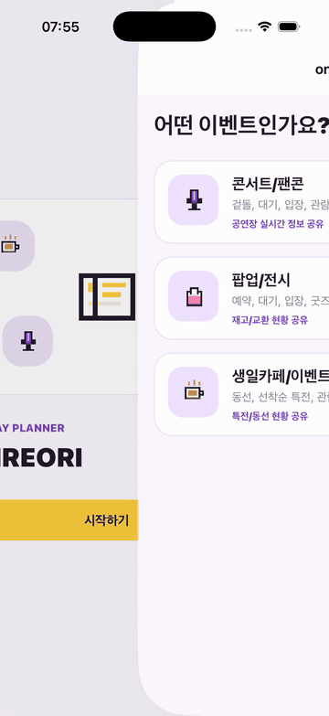
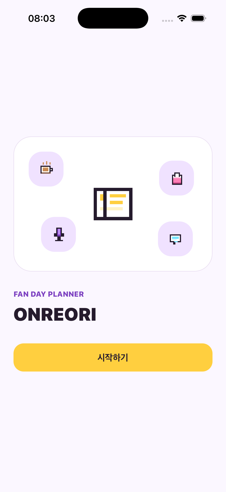
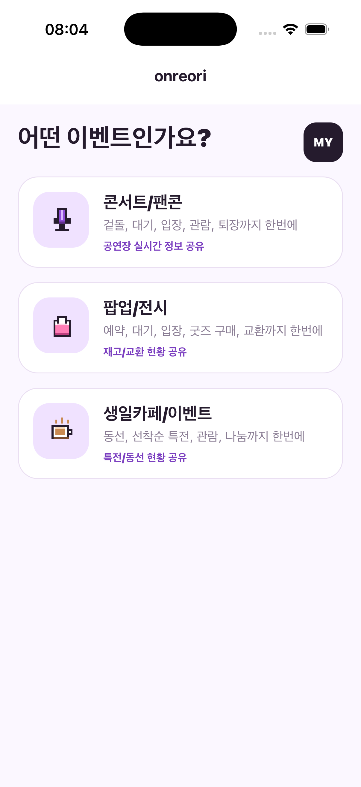
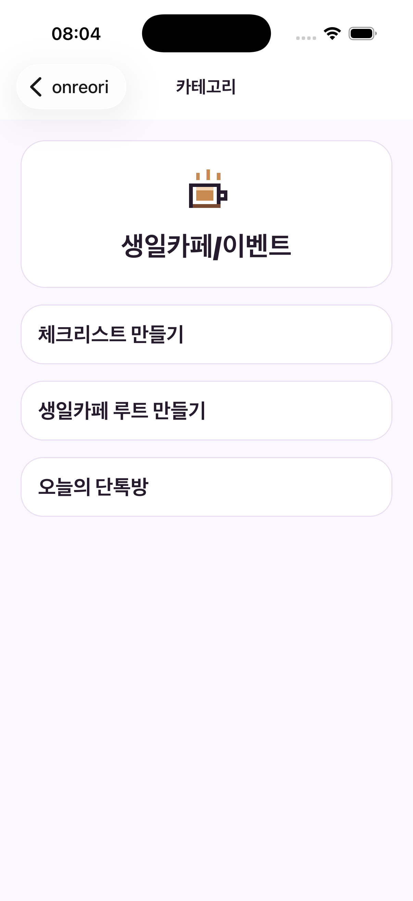
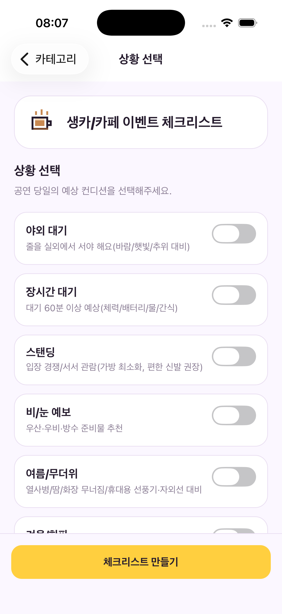
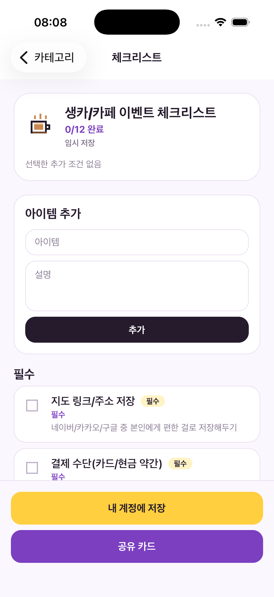
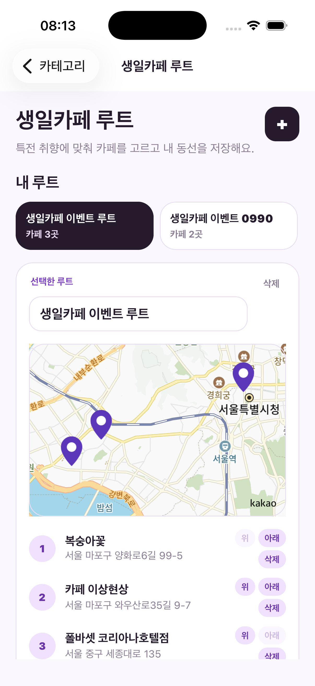
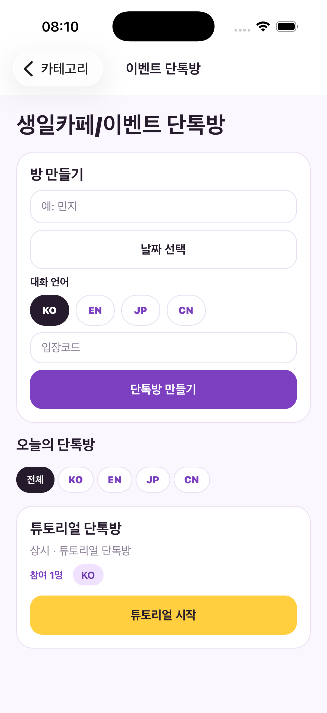
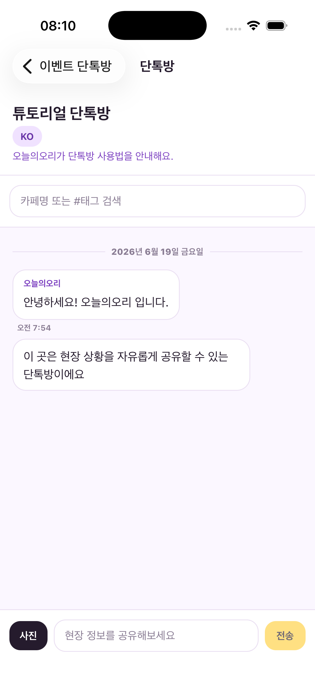

# Onreori

[한국어](#ko) | [English](#en) | [日本語](#ja) | [中文](#zh)

Onreori is a fan event day planner for preparing checklists, sharing live field updates, and saving birthday cafe routes in one React Native app.

## Preview



### Key Screens

<table>
  <tr>
    <td align="center"><br><sub>Launch</sub></td>
    <td align="center"><br><sub>Category</sub></td>
    <td align="center"><br><sub>Feature</sub></td>
    <td align="center"><br><sub>Conditions</sub></td>
  </tr>
  <tr>
    <td align="center"><br><sub>Checklist</sub></td>
    <td align="center"><br><sub>Cafe Route</sub></td>
    <td align="center"><br><sub>Event Rooms</sub></td>
    <td align="center"><br><sub>Chat Room</sub></td>
  </tr>
</table>

## Product Overview

<a id="ko"></a>

### 한국어

팬 이벤트 당일의 준비물, 현장 정보, 이동 동선을 한곳에서 관리하는 React Native 앱입니다. 콘서트/팬콘, 팝업/전시, 생일카페 같은 팬덤 이벤트를 기준으로 체크리스트를 만들고, 현장 단톡방에서 실시간 정보를 나누며, 생일카페 방문 루트를 저장할 수 있습니다.

**주요 기능**

- 이벤트 카테고리 선택: 콘서트/팬콘, 팝업/전시, 생일카페/이벤트 흐름을 구분합니다.
- 상황별 체크리스트: 이벤트 컨디션을 선택해 준비물 리스트를 만들고, 직접 항목을 추가하거나 삭제할 수 있습니다.
- 체크리스트 저장과 공유: 기기 로컬 저장, 계정 동기화, 공유 카드 이미지 저장/공유를 지원합니다.
- 오늘의 단톡방: 이벤트별 방을 만들고 입장 코드로 참여해 현장 정보를 채팅으로 공유합니다.
- 사진과 해시태그 채팅: 텍스트/이미지 메시지와 해시태그 필터링으로 필요한 현장 정보를 빠르게 찾습니다.
- 이벤트 링크 미리보기: 공식 공지/예매 링크에서 제목, 날짜, 장소 후보를 불러와 방 생성 입력을 보조합니다.
- Kakao 지도 기반 장소 선택: 지도 중심, 핀, 장소 검색 결과를 이벤트 장소나 생일카페 루트에 연결합니다.
- 생일카페 루트 관리: 방문할 카페를 순서대로 저장하고 루트 이미지를 사진첩에 내보냅니다.
- 다국어 지원: 한국어, 영어, 일본어, 중국어 앱 언어와 단톡방 언어 필터를 제공합니다.

<a id="en"></a>

### English

Onreori is a React Native app for managing fan event day preparation, live field updates, and travel routes in one place. It helps fans create checklists, share real-time information in event chat rooms, and save birthday cafe routes for concerts, fan concerts, pop-ups, exhibitions, and cafe events.

**Features**

- Event category flow: separates concerts/fan concerts, pop-ups/exhibitions, and birthday cafe events.
- Situation-based checklists: creates preparation lists from selected event conditions, with custom item add/delete support.
- Checklist save and share: supports local device storage, account sync, and share-card image export/sharing.
- Today's event chat rooms: creates category-specific rooms and lets users join with entry codes to share real-time updates.
- Photo and hashtag chat: supports text/image messages and hashtag filtering for quick field information lookup.
- Event URL preview: imports title, date, and location candidates from official notice, ticketing, or guide links.
- Kakao map place selection: connects map center, pin, and search results to event locations or birthday cafe routes.
- Birthday cafe route management: saves cafe stops in order and exports route images to the photo library.
- Multilingual support: supports Korean, English, Japanese, and Chinese app languages and chat room language filters.

<a id="ja"></a>

### 日本語

Onreori は、ファンイベント当日の持ち物、現地情報、移動ルートをひとつにまとめて管理する React Native アプリです。コンサート、ファンコンサート、ポップアップ、展示、誕生日カフェなどのイベントに合わせてチェックリストを作成し、イベント用チャットルームでリアルタイム情報を共有し、誕生日カフェの訪問ルートを保存できます。

**主な機能**

- イベントカテゴリ選択: コンサート/ファンコンサート、ポップアップ/展示、誕生日カフェ/イベントの流れを分けて扱います。
- 状況別チェックリスト: 選択したイベント条件から準備リストを作成し、項目の追加や削除ができます。
- チェックリストの保存と共有: 端末内保存、アカウント同期、共有カード画像の保存/共有に対応します。
- 今日のイベントチャットルーム: イベント別の部屋を作成し、入場コードで参加して現地情報を共有できます。
- 写真とハッシュタグ付きチャット: テキスト/画像メッセージとハッシュタグフィルターで必要な情報を素早く探せます。
- イベント URL プレビュー: 公式告知、チケット、案内リンクからタイトル、日付、場所候補を読み込みます。
- Kakao 地図による場所選択: 地図中心、ピン、検索結果をイベント会場や誕生日カフェルートに紐づけます。
- 誕生日カフェルート管理: 訪問するカフェを順番に保存し、ルート画像を写真ライブラリへ書き出します。
- 多言語対応: 韓国語、英語、日本語、中国語のアプリ言語とチャットルーム言語フィルターを提供します。

<a id="zh"></a>

### 中文

Onreori 是一款 React Native 应用，用于集中管理粉丝活动当天的准备物品、现场信息和移动路线。它面向演唱会、粉丝见面会、快闪店、展览、生日咖啡厅等场景，支持创建检查清单、在活动聊天室中共享实时信息，并保存生日咖啡厅路线。

**主要功能**

- 活动分类流程: 区分演唱会/粉丝见面会、快闪店/展览、生日咖啡厅/活动等使用场景。
- 按情境生成检查清单: 根据选择的活动条件生成准备清单，并支持自定义添加或删除项目。
- 检查清单保存与分享: 支持本地保存、账号同步、分享卡片图片保存/分享。
- 今日活动聊天室: 可按活动创建聊天室，并通过入场码加入以共享现场信息。
- 图片与标签聊天: 支持文本/图片消息和标签筛选，快速查找需要的现场信息。
- 活动链接预览: 从官方公告、票务、指南链接中提取标题、日期和地点候选信息。
- Kakao 地图地点选择: 将地图中心点、标记点、搜索结果连接到活动地点或生日咖啡厅路线。
- 生日咖啡厅路线管理: 按顺序保存要访问的咖啡厅，并将路线图片导出到相册。
- 多语言支持: 支持韩语、英语、日语、中文应用语言以及聊天室语言筛选。

## Developer Guide

### Tech Stack

- React Native 0.84
- React 19
- TypeScript
- React Navigation
- Supabase Auth, Database, Storage, Realtime, Edge Functions
- Kakao Maps SDK / Kakao Local API
- i18next, react-i18next
- AsyncStorage
- react-native-view-shot, react-native-share, CameraRoll
- Jest

### Project Structure

```text
.
├── App.tsx                       # App entry point and navigation stack
├── src/
│   ├── auth/                     # Auth context
│   ├── components/               # Screen-specific and shared UI components
│   ├── config/                   # Supabase runtime configuration
│   ├── data/                     # Event categories and checklist templates
│   ├── i18n/                     # Localization resources
│   ├── screens/                  # App screens
│   ├── services/                 # Supabase, rooms, URL preview, and place search services
│   ├── storage/                  # Local storage
│   ├── theme/                    # Design tokens
│   ├── types/                    # Shared types
│   └── utils/                    # Presentation, policy, and parser utilities
├── supabase/
│   ├── functions/                # Edge Functions
│   └── migrations/               # Database migrations
├── docs/supabase/                # Manual Supabase setup guide
├── android/                      # Android native project
└── ios/                          # iOS native project
```

### Requirements

- Node.js 22.11 or later
- npm
- React Native development environment
- Android Studio or Xcode
- Ruby 3.3.6, Bundler 2.5.22, and CocoaPods for iOS builds
- Supabase CLI

Follow the official React Native [Set Up Your Environment](https://reactnative.dev/docs/set-up-your-environment) guide for the base native development setup.

### Install Dependencies

```sh
npm install
```

Install iOS dependencies after the first clone or whenever native dependencies change.

```sh
rbenv install -s 3.3.6
rbenv local 3.3.6
gem install bundler -v 2.5.22
bundle _2.5.22_ install
cd ios
bundle exec pod install
```

### Run the App

Start Metro first.

```sh
npm start
```

Then run the app for each platform in another terminal.

```sh
npm run android
npm run ios
```

### Environment Variables

Create a local `.env` file based on `.env.example`.

```sh
SUPABASE_URL=https://your-project.supabase.co
SUPABASE_ANON_KEY=your-public-anon-or-publishable-key
EVENT_URL_PREVIEW_ALLOWED_HOSTS=events.example.com,*.example.org
KAKAO_NATIVE_APP_KEY=your-kakao-native-app-key
```

Environment variable usage:

- `SUPABASE_URL`: Supabase project URL.
- `SUPABASE_ANON_KEY`: Public Supabase key bundled with the React Native app. Do not use the service-role key.
- `REACT_NATIVE_SUPABASE_URL`, `REACT_NATIVE_SUPABASE_ANON_KEY`: Alternative names for the Supabase keys.
- `EVENT_URL_PREVIEW_ALLOWED_HOSTS`: Allowlist for the event URL preview Edge Function. Empty means all hosts are denied.
- `KAKAO_NATIVE_APP_KEY`: Native Kakao Maps SDK app key. Android builds fail without this value.

`scripts/inlineSupabaseEnv.js` inlines public Supabase keys during Metro builds. Do not commit real keys to tracked source files.

### Supabase Setup

After Supabase is configured, real login, account checklist storage, event chat rooms, realtime chat, photo uploads, and place search become available. See [docs/supabase/README.md](docs/supabase/README.md) for the detailed setup.

Basic flow:

1. Create a Supabase project.
2. Apply the database schema from `supabase/migrations` or `docs/supabase/schema.sql`.
3. Enable Realtime for `public.chat_messages`.
4. Provide the app with the public Supabase URL and public key.
5. Register the Kakao REST API key as a Supabase secret.
6. Deploy Edge Functions.

```sh
supabase link --project-ref your-project-ref
supabase secrets set KAKAO_REST_API_KEY=your-kakao-rest-api-key
supabase functions deploy kakao-place-search
supabase functions deploy event-url-preview
```

`kakao-place-search` is configured with `verify_jwt = true` in `supabase/config.toml`. Because the React Native app includes a public Supabase key, do not disable JWT verification if you want to protect the server-side Kakao REST API key.

### Development Commands

```sh
npm start        # Start Metro
npm run android  # Run Android app
npm run ios      # Run iOS app
npm test         # Run Jest tests
npm run lint     # Run ESLint
```

### Tests

```sh
npm test
```

Current tests focus on checklist tutorials, cafe routes, event room presentation, chat message handling, and part of the shared UI. When adding new features, prioritize testing decision logic in utilities and services before screen-level behavior.

### License

No license has been specified yet. Decide the license policy before making the repository public.
